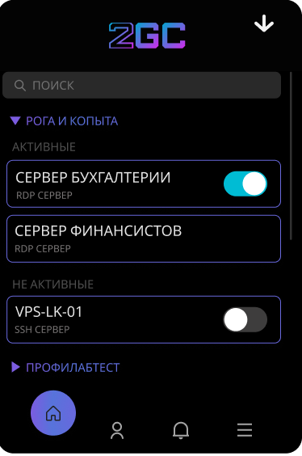

---
layout:
  title:
    visible: true
  description:
    visible: false
  tableOfContents:
    visible: true
  outline:
    visible: true
  pagination:
    visible: true
---

# Десктоп приложение 2GC BUSINESS

**2GC BUSINESS** — это десктопное приложение, которое обеспечивает безопасный удалённый доступ к серверам через протоколы RDP и SSH. В приложении отображаются компании и сервера, доступные пользователю в зависимости от настроек групповых прав. 2GC BUSINESS упрощает управление доступом и подключениями, обеспечивая быструю и надёжную работу с корпоративными ресурсами.

### Вход в программу 2GC BUSINESS

\
\

В начальной страницы необходимо авторизоваться, используя логин и пароль от личного кабинета **2GC**.\
Кнопка сохранить, позволяет вновь запуска приложения **2GC BUSINESS** входить без авторизации.

### Список серверов&#x20;

После успешной авторизации, программа автоматически переключится на вкладку "home".&#x20;

* Поле "поиск" нужен для быстрого поиска нужного сервера
* Поле "организации" отображаются доступные компании (преимущественно для аусорсинга)
* Поле "сервера" отображаются название сервера (указывается в личном кабинете), также протокол подключения.
* Бегунок создает туннель либо отключает при нажатии

\
\

<figure><figcaption></figcaption></figure>

